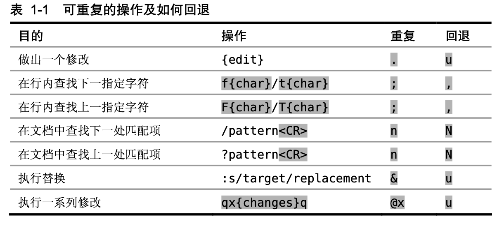

# vim 实用技巧

## 配置文件
mac下有3个配置文件 
- .vim 文件夹，用于系统级别配置
- .viminfo 存储vim历史状态信息
- .vimrc 用户自定义，用于用户级别配置

## vim解决问题方式


```.``` 指令 重复上一个修改指令。可以重复执行命令模式下的指令，还可以记录执行输入模式时的操作

\> 缩进文本


不自我重复：可以一步完成，不要两步

例如要在每一行末尾添加';'
> var foo = 1
> 
> var bar = 'a'
> 
> var foobar = foo + bar

一个高效做法是 ```$a;esc```，这样第一行添加成功。
然后执行两次 ```j$.```
这样 '.' 的作用和 ```a;esc``` 相同，少按两个键

a是在光标后添加字符，并进如insert模式
A是光标移动到本行末尾并进入insert模式
I光标移动到行首并进入insert模式

更高效的做法是```A;esc```，然后两次```j.```


fa 将光标定位到当前位置到行尾位置的第一个a处，如果没有a，则光标不动

ta 将光标定位到a前一个位置，其余同f

F/Ta在行内查找上一个字符a

s 删除当前字符并进入insert模式

S 删除当前行并进入insert模式

C 删除光标至行尾


如果想将

var foo = "method("+argument1+","+argument2+")";

的每个‘+’前后添加空格成如下样式

var foo = "method(" + argument1 + "," + argument2 + ")";

可以使用

```
f+
s␣+␣<Esc>
;.
;.
;.
```
```;```表示重复上一个查找指令

 ```,``` 这个命令会反方向查找上次 f{char}所查找的字符




```*``` 查找当前光标下的单词

```n``` 跳转到下一个匹配项


### 技巧8 把撤销单元切成块

```u```键会触发撤销命令，它会撤销最新的修改。一次修改可以是改变文档内文本的
任意操作，其中包括在普通模式、可视模式以及命令行模式中所触发的命令，而且一
次修改也包括了在插入模式中输入（或删除）的文本，因此我们也可以说， i{insert some
text}<Esc> 是一次修改。

在 Vim 中，我们自己可以控制撤销命令的粒度。从进入插入模式开始，直到返回普
通模式为止，在此期间输入或删除的任何内容都被当成一次修改。因此，只要我们控制
好对 <Esc> 键的使用，就可使撤销命令作用于单词、句子或段落。

如果在插入模式中使用了 <Up> 、 <Down> 、 <Left>
或 <Right> 这些光标键，将会产生一个新的撤销块

